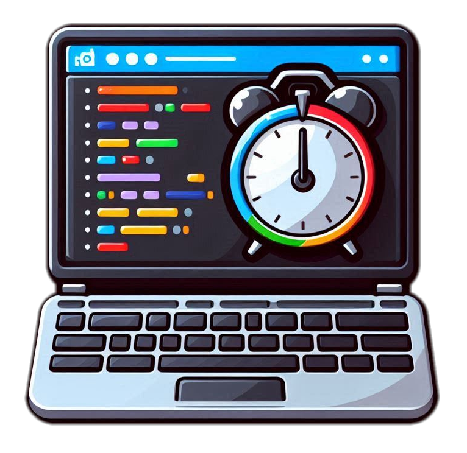
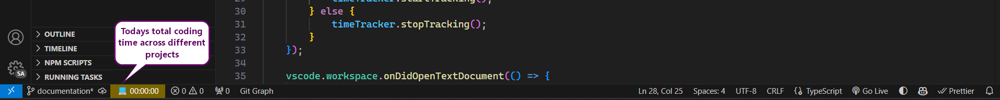
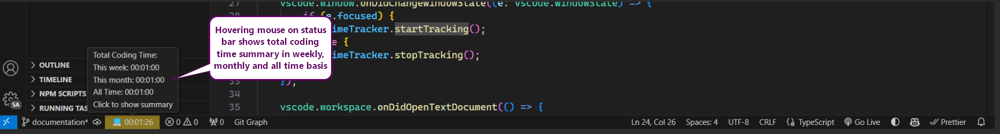
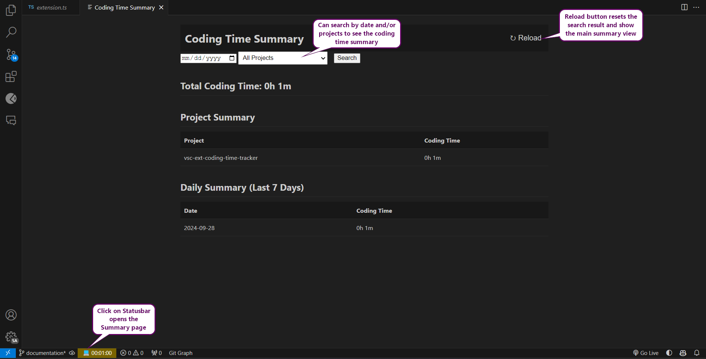

    
    <h1>Simple Coding Time Tracker: A Visual Studio Code Extension</h1>

Simple Coding Time Tracker is a powerful extension for Visual Studio Code that helps you monitor and analyze your coding time. If you are curious about your coding habits, this extension covers you.

## Features

- **Automatic Time Tracking**: Seamlessly tracks your coding time in the background.
- **Project-based Tracking**: Organizes time data by project for easy analysis.
- **Status Bar Display**: Shows your today's total coding time duration in real-time.
- **Tooltip on Status Bar**: Shows the total coding time weekly, monthly and all time basis. 
- **Detailed Summaries**: View comprehensive reports of your coding activity. You can search your total time on a particular day or project.
- **Data Persistence**: Safely stores your time data for long-term analysis.

## Screenshots
### Status Bar
Status bar resets to zero at midnight each day and hence shows the coding time for the current day.

### Tooltip
Tooltip shows the total coding time weekly, monthly and all time basis.

### Summary page
You can search your total time on a particular day or project.

### Summary page with date range search - new feature from [0.2.0]

## Installation

1. Open Visual Studio Code
2. Go to the Extensions view (Ctrl+Shift+X or Cmd+Shift+X on macOS)
3. Search for "Simple Coding Time Tracker"
4. Click "Install"

## Usage

Once installed, the extension will automatically start tracking your coding time. You can view your current session time in the status bar at the bottom of the VSCode window.

To access detailed summaries and reports, use the command palette (Ctrl+Shift+P or Cmd+Shift+P on macOS) and search for "Time Tracker" to see available commands.

## Data Saving Interval

The Simple Coding Time Tracker saves your coding time data to the background storage every 60 seconds (1 minute). This ensures that your progress is regularly recorded while minimizing the impact on performance.

## Changelog

### [0.2.0] - 2024-10-02
- Enhanced the UI of the summary view for a more professional look
- Implemented date range search functionality
- Added a reload button to reset search fields and refresh data
- Improved the layout and styling of the Total Coding Time section

### [0.1.4] 
- Initial release
- Automatic time tracking
- Project-based tracking
- Status bar display with tooltip
- Detailed summary view
- Data persistence

## Feedback and Contributions

We welcome feedback and contributions! If you encounter any issues or have suggestions for improvements, please open an issue on our GitHub repository.

For developers interested in contributing to the project, please check out our [CONTRIBUTING.md](CONTRIBUTING.md) file for guidelines and instructions.

